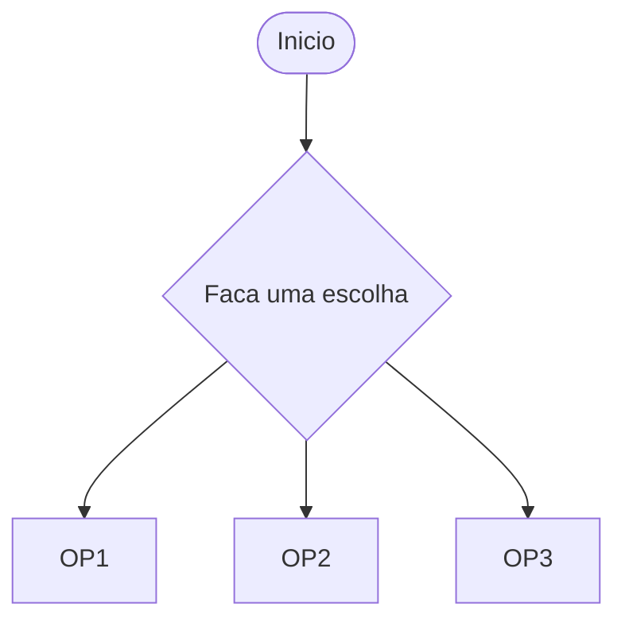
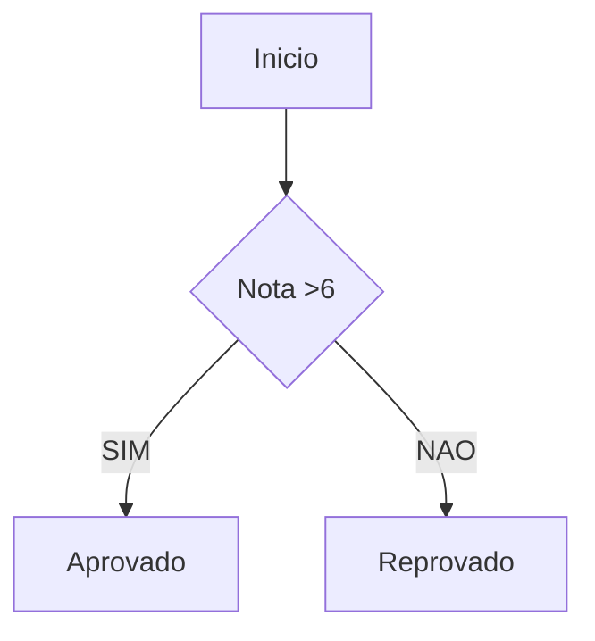

# Grafico-Gannt

```mermaid
flowchart TD

A(["Inicio"])
A --> B{"Faca uma escolha"}
B --> C["OP1"]
B --> D["OP2"]
B --> E["OP3"]
```

```mermaid
graph TD;
A[Inicio] --> B{Nota >6};
B --> |SIM| C[Aprovado];
B --> |NAO| D[Reprovado];
```
```mermaid
gantt
  title Exemplo de Grafico de Gantt
  dateFormat YYYY-MM-DD
  section 1ºBimestre
  section 2º Bimestre
```
